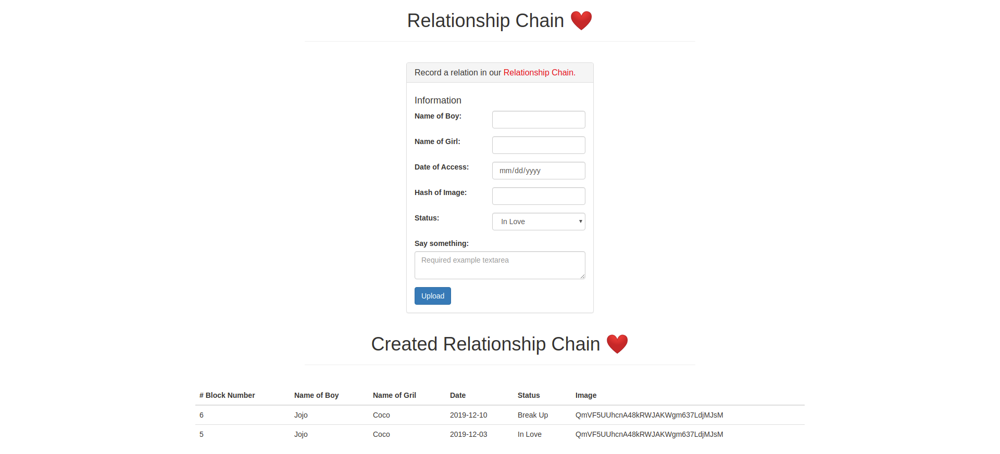

# Relationship Chain

## How to deploy it
- Open ganache with port HTTP://127.0.0.1:7545
- Open a terminal with command: `cd DiamondChain; truffle migrate` to complie the constract and migrate it into the bloackchain.
- Open a terminal with command: `cd DiamondChain/src; npm run dev` to complie the front-end web page.

The reults should be like this:

